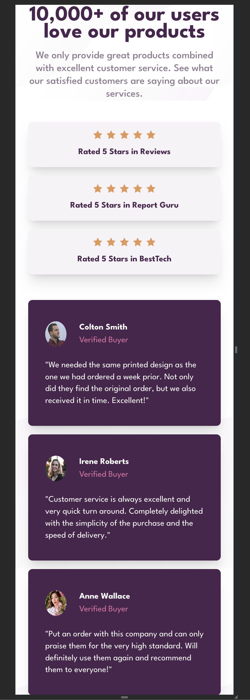

# Frontend Mentor - Social proof section solution

This is a solution to the [Social proof section challenge on Frontend Mentor](https://www.frontendmentor.io/challenges/social-proof-section-6e0qTv_bA). Frontend Mentor challenges help you improve your coding skills by building realistic projects.

## Table of contents

- [Overview](#overview)
  - [The challenge](#the-challenge)
  - [Screenshot](#screenshot)
  - [Links](#links)
- [My process](#my-process)
  - [Built with](#built-with)
  - [What I learned](#what-i-learned)
  - [Continued development](#continued-development)
  - [Useful resources](#useful-resources)
- [Author](#author)
- [Acknowledgments](#acknowledgments)

## Overview

### The challenge

Users should be able to:

- View the optimal layout for the section depending on their device's screen size.

### Screenshot




### Links

- [Check out the code here](https://github.com/John-Davidson-8/fem-social-proof-section-master)
- [Check out the site here](https://fem-social-proof-section-site.netlify.app/)

## My process

I began mobile first and using a one Grid column, then I set the responsive expansion media query at 70rem. I created one header and two sections. One section was five star review section created with small cards using CSS Flexbox. The second section was a testimonial section with three cards. In mobile version everything stacked in one column. For desktop it was two columns.

### Built with

- Semantic HTML5 markup
- CSS custom properties
- Flexbox
- CSS Grid
- Mobile-first workflow

### What I learned

Primarily this project was aimed at furthering my CSS Grid skills. Placing cards within a container in a laddered/staggered way was tricky, I had to create multiple rows for one and multiple columns for the other section. What was cool was that in creating the container with multiple rows, implicit rows kicked in when I commented out my proposed solution! Also, I once again managed to create a sticky footer with the attribution within it. It stays at the bottom of the viewport no matter what. Also, I used a class to maintain a consistent width throughout each section.

Below is an example of code to keep the content aligned and justified centrally. This works well.

```css
.container {
  min-height: 100vh;
  max-width: 36rem;
  margin: 4rem auto;
  background: var(--clr-secondary-3-white);
}
```

Below is the CSS Grid for the five star review section with multiple columns to make a laddered/staggered effect. This was created for the desktop version with media query set at 70rem, as mobile version only required cards to be stacked.

```css
.five-star-reviews {
  padding: 4rem 0 2rem 0;
  display: grid;
  grid-template-columns: repeat(15, 1fr);
  max-height: 20rem;
}
```

### Continued development

This is my third project using CSS Grid. It was more complex than the last couple and took a bit research. I am going to continue focusing on learning Grid and Javascript simultaneously.

### Useful resources

- [13 minute tutorial on Grid from Slaying the Dragon](https://www.youtube.com/watch?v=EiNiSFIPIQE&t=367s) - This short Youtube tutorial was excellent at reminding me of what I had read about previously on CSS Grid. All in the space of 13 minutes. Great teacher!
- [Check out Shruti Balasa's book on CSS Flex and Grid](https://shrutibalasa.gumroad.com/l/css-flex-and-grid) - one of the most valuable resources on this for less than £20. She has fantastic exercises and explains concepts clearly.

## Author

- Website - [John Davidson](https://www.upwork.com/en-gb/freelancers/~018613765e268de80b)
- Frontend Mentor - [@John-Davidson-8](https://www.frontendmentor.io/profile/John-Davidson-8)
- Twitter - [@jodo828](https://twitter.com/jodo828)

## Acknowledgments

Thanks to Florin.Porut06,
Daniel Moraes Mariz, and AlexKMarshall
in the Frontend Mentor community for answering my questions.
